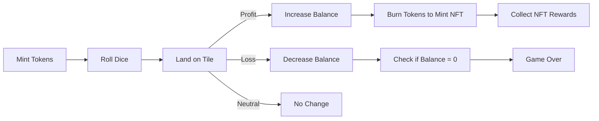

# 🏦 HederaPoly

> 🎯 **HederaPoly** is a decentralized, tokenized twist on *Monopoly* — blending gaming, NFTs, and DeFi strategy on the **Hedera network**. It demonstrates real-world use of smart contracts, verifiable randomness, and token economy — all inside a fun, interactive experience.

## 🚨 Problem

Blockchain gaming today often faces three major problems:

* ❌ Lack of **fair randomness**, leading to distrust.
* 💸 Poor **token economy design**, causing inflation or imbalance.
* 🕹️ Limited **true ownership** of in-game assets.

## 💡 Solution

HederaPoly solves these challenges through:

* ✅ **Verifiable, pseudorandom gameplay** for dice rolls and outcomes.
* 🔥 **Deflationary tokenomics**, where players burn tokens to mint NFTs.
* 🪙 **True digital ownership** of rewards and assets through ERC-1155 tokens.
* ⚡ **Fast, low-cost, and eco-friendly transactions** powered by **Hedera Hashgraph**.

## 🕹️ Gameplay Overview

Players mint **100 HPOLY tokens (ERC-1155)** and begin with a 100-token balance.
They navigate a **12-tile game board**, rolling a virtual die to land on tiles that yield profit or loss:

| Tile Type | Token Change      | Example Range |
| --------- | ----------------- | ------------- |
| Profit    | +80 to +160 HPOLY | 🟩 Gain       |
| Loss      | −50 to −120 HPOLY | 🟥 Lose       |
| Neutral   | 0                 | ⚪ Hold steady |

Players can burn tokens (1000+) to mint **unique NFTs**, up to **6000 NFTs total** and **12M total tokens**.

The game ends if a player’s balance hits zero or supply caps are reached.
Strategy and risk management determine survival and success.

## 🧩 Features

* **ERC-1155 Tokens** – HPOLY tokens and NFT rewards.
* **Fair Randomization** – On-chain PRNG with fallback logic.
* **Token Burn Mechanics** – Create scarcity and reward commitment.
* **Owner Controls** – Manage token caps, game state, and minting.
* **Hedera Smart Contract** – Fast, low-cost, and secure.

## 🧱 Architecture & Tech Stack

| Layer                 | Technology                   |
| --------------------- | ---------------------------- |
| **Smart Contract**    | Solidity (ERC-1155 standard) |
| **Blockchain**        | Hedera Hashgraph (Testnet)   |
| **Integration**       | Hedera SDK, HashConnect      |
| **Frontend**          | React + Vite *(if used)*     |
| **Wallets Supported** | Metamask, OKX                |
| **Storage**           | IPFS (for NFT metadata)      |
| **Randomness**        | Custom PRNG logic            |

## 🚀 Getting Started

### 1️⃣ Prerequisites

* Get Hedera testnet tokens via the [Faucet](https://portal.hedera.com/faucet)
* Install a compatible wallet:

  * [OKX Wallet](https://chromewebstore.google.com/detail/okx-wallet/mcohilncbfahbmgdjkbpemcciiolgcge)
  * [Metamask Wallet](https://chromewebstore.google.com/detail/metamask/nkbihfbeogaeaoehlefnkodbefgpgknn?hl=en)
* Add the [Hedera Test Network](https://chainlist.org/?search=hedera&testnets=true) via Chainlist.

### 2️⃣ Deploy & Play

1. Deploy the contract.
2. Mint 100 HPOLY tokens with `mintTokens()`.
3. Start the game with `startGame()`.
4. Roll dice with `rollDice()`.
5. Burn 1000+ HPOLY to mint an NFT using `mintNFT()`.

## 🧾 Contract Details

* **Contract ID:** `0.0.6836339`
* **Contract Address:** `0x8F1e1DC747D66EA0958e271d7EFe1503a77c719E`

## 🎮 Game Preview

  

  

## 🧠 Gameplay Flow

## 🧑‍💻 Team

| Name                | Role                     | Focus                         |
| ------------------- | ------------------------ | ----------------------------- |
| **{Emmanuel  Ekpe]** | Smart Contract Developer | Tokenomics, Game Logic        |
| **[John Olorunmola]** | Frontend Engineer        | UI/UX & Gameplay Interface    |
| **[Godstime Mgboawaji]** | Integrations Lead        | Hedera SDK, Wallet Connection |
| **[Emmanuel  & John]** | QA / Documentation       | Testing & Deployment          |

## 🌍 Vision & Future Plans

* 🔗 Integrate **Chainlink VRF** for verifiable randomness
* 🏪 Add an **NFT Marketplace** for HPOLY collectibles
* 🎮 Expand to **multiplayer gameplay**
* 🌐 Deploy to **Hedera mainnet**
* 💰 Introduce **staking & rewards** for HPOLY holders

## 🧠 Key Takeaway

> “HederaPoly isn’t just a game — it’s an experiment in transparent token economies, powered by the speed and fairness of Hedera.”

## 🪙 Badges

## 🤝 Contact

* **Team Email:** [hackathon@hashgraph-association.com](mailto:hackathon@hashgraph-association.com)
* **Demo Link:** [https://www.instagram.com/p/DO0OqGwjLwU/?igsh=MWQyMXkxdWNiN29tZA==]

